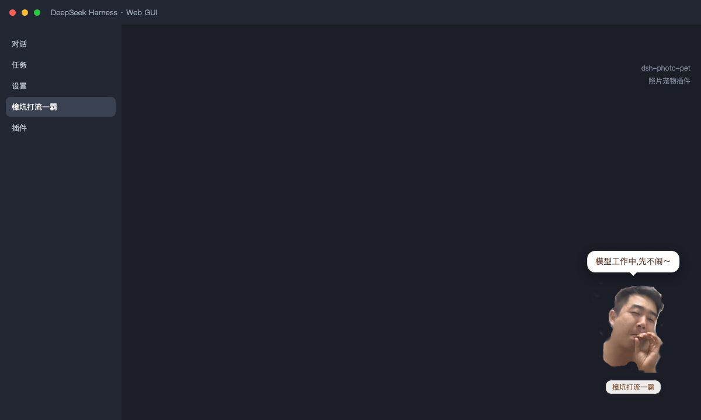

# dsh-photo-pet — Photo Pet Plugin

[中文](README.md) | English

> Turn any photo into a floating pet inside the DeepSeek Harness (DSH) Web GUI.

Upload your photo and it becomes a pet that lives in the corner of your browser: draggable, one-click AI cutout for a clean background, nameable, with a hover fan menu, and it bubbles custom lines while the model is working. The photo IS the pet — no frames, no templates, shown as-is.



## What is this? Where does it live?

**DeepSeek Harness (DSH)** is an extensible AI-assistant runtime: a single `dsh` command boots it, and "profiles + plugins" compose different app shapes. `dsh web` starts the **web GUI** — the browser-based chat/tasks/settings UI, by default at `http://127.0.0.1:3080`.

**This plugin installs into that web GUI**: once installed, a pet appears in the bottom-right corner of the page. Its look is the photo you upload; it bubbles lines while the model works, and hovering it pops up a function menu.

```
Browser (web GUI at 127.0.0.1:3080)
└── dsh web profile
    ├── Chat / Tasks / Settings (built into DSH)
    └── 🐾 Floating pet in the corner ← this plugin (dsh-photo-pet)
```

## Features

| Feature | Description |
|---|---|
| Photo as pet | The uploaded photo is the pet itself; width adjustable, height follows the photo's aspect ratio |
| AI auto cutout | After upload, the subject is detected and cut out automatically (denoise, decontaminate edges, auto-crop); the open-source model runs in the browser, images never leave your machine |
| Smart trim | Automatically removes solid-color borders around the photo on upload |
| Manual cutout editor | Built-in editor with eraser/brush plus a re-run AI cutout button |
| Drag to move | Drag the pet anywhere; the position is saved automatically |
| Naming | The pet has its own name shown in a hover nameplate; editable in settings |
| Working lines | Custom bubble lines (one per line) while the model works; swap interval configurable |
| Click lines | Rotates through custom bubble lines on every click; configurable |
| Feeding | 🍗 in the fan menu: the pet bounces, a snack floats up, feeding lines rotate; configurable |
| Hover fan menu | Circular menu on hover; every item can be toggled, with show-all / hide-all shortcuts |
| State animations | Idle sway, click bounce, working sway with a cigarette smoke effect |
| Hide / summon | One-click hide; hovering the spot brings up a summon button |
| Settings panel | "My Pet" left-nav section: enable, visibility, name, size, position, trim/AI toggles, lines & menu config; renaming updates the menu live |
| One-click update / uninstall | Shows the plugin version; updates from npm or uninstalls in one click (auto-restarts after) |

## Installation

### Step 1: Install DeepSeek Harness

> Already using DSH (you can open the web GUI at `http://127.0.0.1:3080`)? **Skip to Step 2.**

```bash
# Requires Node.js 20+ (22 or 24 recommended)
npm install -g @deepseek-ai/dsh

# Verify
dsh --version
```

### Step 2: Start the DSH web GUI

```bash
dsh web
```

Then open **http://127.0.0.1:3080** in your browser — this is the GUI the plugin moves into.

> Port defaults to 3080; if it is taken, use e.g. `dsh web --port 8080` — nothing else changes.

### Step 3: Install the plugin

**Option A: one npm command (recommended)**

```bash
dsh plugin --profile web add dsh-photo-pet
```

This command wires everything for you: installs the dependency and automatically adds the plugin to the `web` profile's `dsh.profile.bundles` registry. Then **restart the web service** and refresh the browser:

```bash
kill $(lsof -ti :3080)     # stop the old service
dsh web                    # start it again
```

> Tip: if you see `pnpm not found`, install pnpm first: `npm install -g pnpm`.

**Option B: install from GitHub (optional — for people who want to tweak the source)**

```bash
# 1. Clone the plugin
git clone https://github.com/tangkui/dsh-photo-pet.git
cd dsh-photo-pet
npm install
```

```bash
# 2. Link the plugin into the DSH profile
#    Edit ~/.dsh/profiles/web/package.json:
```

```jsonc
{
  "name": "dsh-profile-web",
  "private": true,
  "dependencies": {
    // ...existing dependencies
    "dsh-photo-pet": "link:/absolute/path/to/dsh-photo-pet"
  },
  "dsh": {
    "profile": {
      "bundles": [
        // ...existing bundles
        "dsh-photo-pet"
      ]
    }
  }
}
```

```bash
# 3. Restart DSH Web (kill the process on port 3080; DSH restarts itself)
kill $(lsof -ti :3080)

# 4. Verify: refresh the page in your browser
#    - A pet appears in the bottom-right corner (built-in default look first)
#    - No console errors; the bundle is served at:
curl -s http://127.0.0.1:3080/plugins/dsh-photo-pet/client.js
```

### Step 4: Make the pet yours

1. Refresh the page — the default pet appears in the bottom-right corner
2. Open **Settings → My Pet** in the left navigation
3. Click **Upload photo** and pick your photo (AI cutout runs automatically; the image never leaves your machine)
4. Name the pet and drag it where you like — done 🎉

## Configuration

Open **Settings → My Pet** in the left navigation:

- **Enable pet / Show pet** — master switch and hide (hover to summon when hidden)
- **Pet name** — shown on the nameplate; the left-nav menu follows it live
- **Size / Right offset / Bottom offset** — size and position
- **Smart trim / AI auto cutout** — automatic processing toggles on upload
- **Working lines / Swap interval** — bubble text and rotation pace while working
- **Click lines** — bubble text on every click, one line per click
- **Feeding lines** — bubble text when feeding via 🍗, one line per feed
- **Hover menu items** — per-item toggles with show-all / hide-all shortcuts
- **Quick actions** — upload photo / AI cutout / reset photo, same actions as the fan menu
- **Plugin management** — shows the installed plugin version; checks and updates from npm in one click, or uninstalls (the GUI restarts automatically after)

## Data & cache

- Pet photo & settings: `~/.dsh/photo-pet/`
- AI cutout model cache: `~/.dsh/photo-pet/ai/<version>/` (downloaded on first use, ~44 MB, offline afterwards)

## Uninstall

```bash
dsh plugin --profile web remove dsh-photo-pet
```

To also remove the pet photo and model cache: `rm -rf ~/.dsh/photo-pet` (does not affect DSH itself).

## How it works

- **Host half** (`lib/index.js`): registers the `photo-pet` settings namespace, serves `/api/photo-pet/*` routes (photo storage, activity polling) and the AI cutout proxy (`/api/photo-pet/ai/*`, model downloaded on demand and cached under `~/.dsh/photo-pet/ai/<version>/`).
- **Client half** (`lib/client.js`): renders the pet, animations, bubbles, fan menu and the cutout editor in the browser; registers "My Pet" as a first-level settings section through the `settings.section` slot.
- **Packaging**: profile dependency + `dsh.profile.bundles` registration; the plugin's `cordis.patch.yml` (`dsh.bundle.patch`) inserts its row into the web plugin roster.

## Development

```bash
# Smoke tests (headless jsdom: mount / menu / upload / AI path / work lines / settings card)
# Note: the test environment needs Node.js >= 22.19 (jsdom 30 pulls in undici 8)
cd test
npm install
npm test
```

GitHub Actions runs the same smoke suite on every push / PR (`.github/workflows/ci.yml`). **`main` is protected: all changes must come from other branches via Pull Request with at least 1 review and a green CI.**

Layout:

```
dsh-photo-pet/
├── lib/index.js        # Host half: routes / settings namespace / AI proxy
├── lib/client.js       # Client half: pet, animations, menu, editor
├── cordis.patch.yml    # Bundle patch: inserts the plugin row into the web roster
├── test/               # jsdom smoke tests
├── package.json
└── README.md
```

## License

[MIT](LICENSE)

A DeepSeek Harness ecosystem plugin, same license as [deepseek-ai/dsh](https://github.com/deepseek-ai/dsh).
